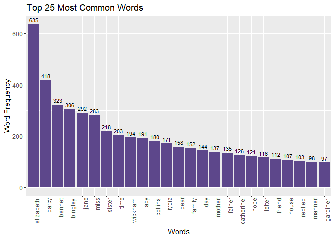

# Strings and functional programming in R

#### **Exercise 1 (37.5 points)**

Take a Jane Austen book contained in the janeaustenr package, or another
book from some other source, such as one of the many freely available
books from Project Gutenberg (be sure to indicate where you got the book
from). Make a plot of the most common words in the book, removing “stop
words” of your choosing (words like “the”, “a”, etc.) or stopwords from
a pre-defined source, like the stopwords package or
tidytext::stop\_words.

If you use any resources for helping you remove stopwords, or some other
resource besides the janeaustenr R package for accessing your book,
please indicate the source. We aren’t requiring any formal citation
styles, just make sure you name the source and link to it.

-   Load necessary packages

<!-- -->

    suppressWarnings(suppressPackageStartupMessages(library(janeaustenr)))
    suppressWarnings(suppressPackageStartupMessages(library(tidyverse)))
    suppressWarnings(suppressPackageStartupMessages(library(tidytext)))

-   Select the book/data to use in this task

<!-- -->

    # Selecting Pride&Prejudice book to use in this task
    PridePrejudice <- janeaustenr::prideprejudice

-   Clean the text and remove all non-alphabetic characters

<!-- -->

    words_text <- PridePrejudice %>%
      str_to_lower() %>%
      str_replace_all("[^[:alpha:]]", " ") %>% # "^[[:alpha:]]" matches any alphabetic character, and "^" negate it => Thus remove all non-alphabetic characters 
      str_split("\\s+") %>%  # "\\s+" = extract words / matches one or more white space characters
      unlist() %>%
      discard(str_detect, "^$") #  discard elements that are empty strings

-   Filter out stop words

<!-- -->

    # Define stop words list to filter out using a pre-defined source (tidytext::stop_words)
    stop_words <- tidytext::stop_words
    stop_words_list <- stop_words %>%
      select(word) %>%
      pull()
    # Remove stop words
    filtered_words <- words_text[!words_text %in% stop_words_list]

-   Organize data frame

<!-- -->

    # Create a data frame with word frequencies
    word_frequency <- table(filtered_words)
    # Convert to data frame for plotting with ggplot2
    word_freq_df <- data.frame(Word = names(word_frequency), Frequency = as.numeric(word_frequency))

    top_25_words <- word_freq_df %>%  #arrange words by most frequent
      arrange(desc(Frequency)) %>%
      head(25) # select top 25
    print(top_25_words)

    ##         Word Frequency
    ## 1  elizabeth       635
    ## 2      darcy       418
    ## 3     bennet       323
    ## 4    bingley       306
    ## 5       jane       292
    ## 6       miss       283
    ## 7     sister       218
    ## 8       time       203
    ## 9    wickham       194
    ## 10      lady       191
    ## 11   collins       180
    ## 12     lydia       171
    ## 13      dear       158
    ## 14    family       152
    ## 15       day       144
    ## 16    mother       137
    ## 17    father       135
    ## 18 catherine       126
    ## 19      hope       121
    ## 20    letter       116
    ## 21    friend       112
    ## 22     house       107
    ## 23   replied       103
    ## 24    manner        98
    ## 25  gardiner        97

-   Create a plot with the most common words

<!-- -->

    ggplot(top_25_words, aes(x = reorder(Word, -Frequency), y = Frequency)) +
      geom_bar(stat = "identity", fill = "mediumpurple4") +
      labs(title = "Top 25 Most Common Words", x = "Words", y = "Word Frequency") +
      theme(axis.text.x = element_text(angle = 90, hjust = 1.1))+
      geom_text(aes(label = Frequency), vjust = -0.5, size = 3)

